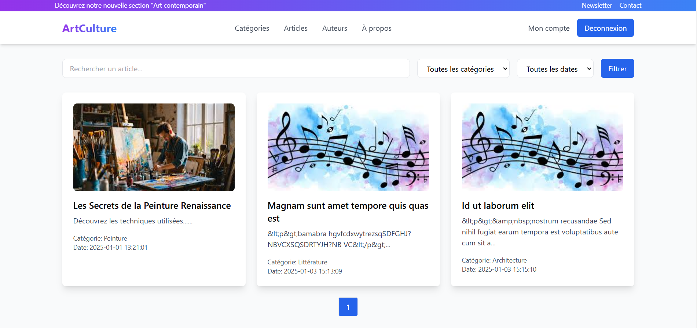
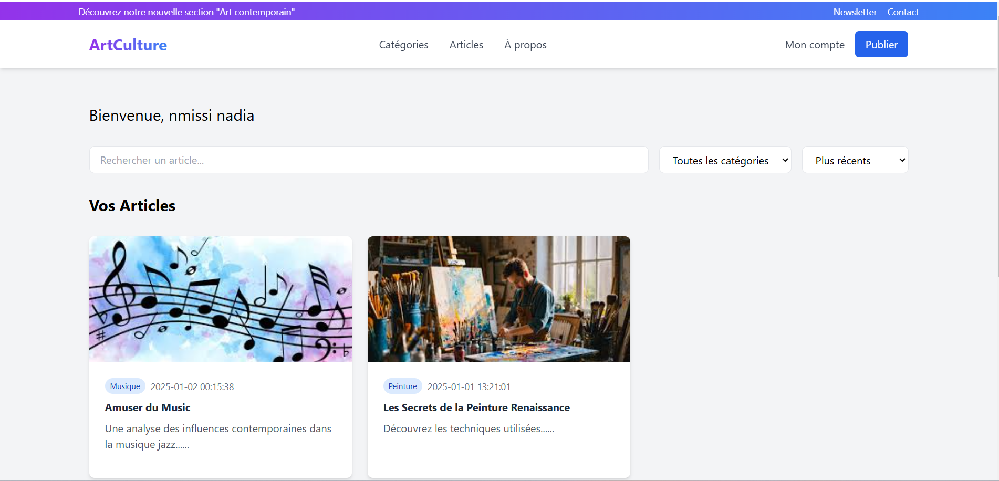
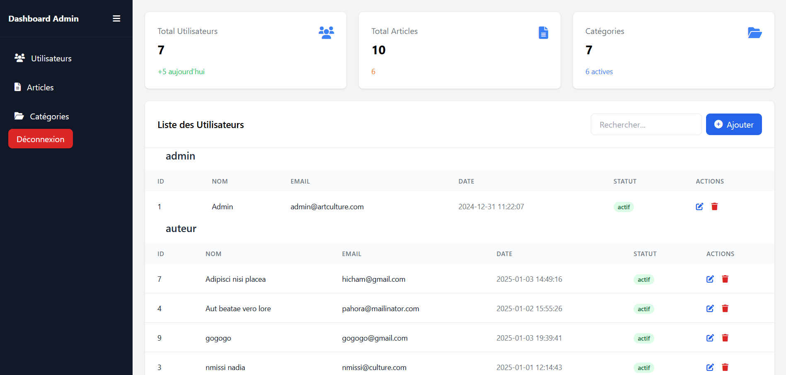

# Cultures_Partagees
Cultures Partagées a besoin d'un système de gestion de contenu performant et d'un front convivial pour faciliter la création, l'organisation et la découverte d'articles culturels sur la plateforme.


---

# **ArtCulture - Plateforme de Promotion de l'Art et de la Culture**

## 🎨 **Description du Projet**
**ArtCulture** est une plateforme web dédiée à la promotion de l'art et de la culture. Elle permet :
- Aux passionnés de découvrir et d'explorer des articles variés sur la peinture, la musique, la littérature, le cinéma, et plus encore.
- Aux auteurs de publier et partager leurs propres articles.
- Aux administrateurs de gérer efficacement les utilisateurs, les articles et les catégories.

L'objectif principal est de créer une communauté dynamique et enrichissante autour des passions artistiques et culturelles.

---

## 🚀 **Fonctionnalités**
### **Utilisateur :**
- 🔑 Inscription et connexion sécurisées.
- 🔍 Navigation et exploration des articles classés par catégories.
- 📚 Lecture des derniers articles publiés sur la page d'accueil.

### **Auteur :**
- 🔑 Inscription et connexion sécurisées.
- ✏️ Création, modification, et suppression d'articles.
- 📊 Tableau de bord personnel pour gérer ses propres publications.

### **Administrateur :**
- 🔑 Connexion sécurisées.
- 📂 Gestion des catégories (création, modification, suppression).
- 👥 Gestion des utilisateurs (activation, suspension, ou bannissement).
- 📝 Validation ou rejet des articles soumis par les auteurs.

---

## 🛠️ **Technologies Utilisées**
- **Frontend :** HTML, CSS (Tailwind CSS), JavaScript.
- **Backend :** PHP 8 (Programmation Orientée Objet) avec PDO.
- **Base de Données :** MySQL.
- **Framework CSS :** Tailwind CSS.
- **Gestion de Projet :** Méthodologie Scrum (planification via Jira).

---

## ⚙️ **Installation et Configuration**

### **1. Prérequis**
- PHP 8.0 ou supérieur.
- MySQL.
- Serveur local (XAMPP, WAMP, Laragon, etc.).

### **2. Installation**
1. Clonez le projet depuis le dépôt GitHub :
   ```bash
   git clone https://github.com/nmissi-nadia/Cultures_Partagees.git
   ```
2. Importez le fichier SQL pour configurer la base de données :
   ```sql
   source Doc/script.sql;
   ```
3. Configurez la connexion à la base de données dans `db.php` :
   ```php
   $dsn = 'mysql:host=localhost;dbname=art_culture';
   $username = 'votre_nom_utilisateur';
   $password = 'votre_mot_de_passe';
   ```

### **3. Lancer le Projet**
- Placez les fichiers du projet dans le répertoire de votre serveur local (ex : `htdocs`).
- Accédez au projet via votre navigateur :
  ```
  http://localhost/Cultures_Partagees
  ```

---

## 🎯 **Points Forts**
- **Interface Utilisateur Moderne :** Conçue avec Tailwind CSS pour une expérience utilisateur fluide.
- **Sécurité Renforcée :**
  - Validation des données côté serveur et côté client.
  - Prévention des attaques XSS et SQL Injection via PDO et `htmlspecialchars`.
- **Structure Modulaire :** Respect des principes SOLID en PHP.

---

## 📸 **Aperçus**

### **1. Page d'Accueil**


### **2. Tableau de Bord Auteur**


### **3. Gestion des Articles pour Administrateur**


---


## 📧 **Contact**
- **Auteur :** Nadia Nmissi
- **Email :** nmissinadia@gmail.com
- **GitHub :** [nmissi-nadia](https://github.com/nmissi-nadia)

---

